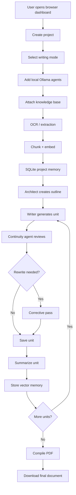
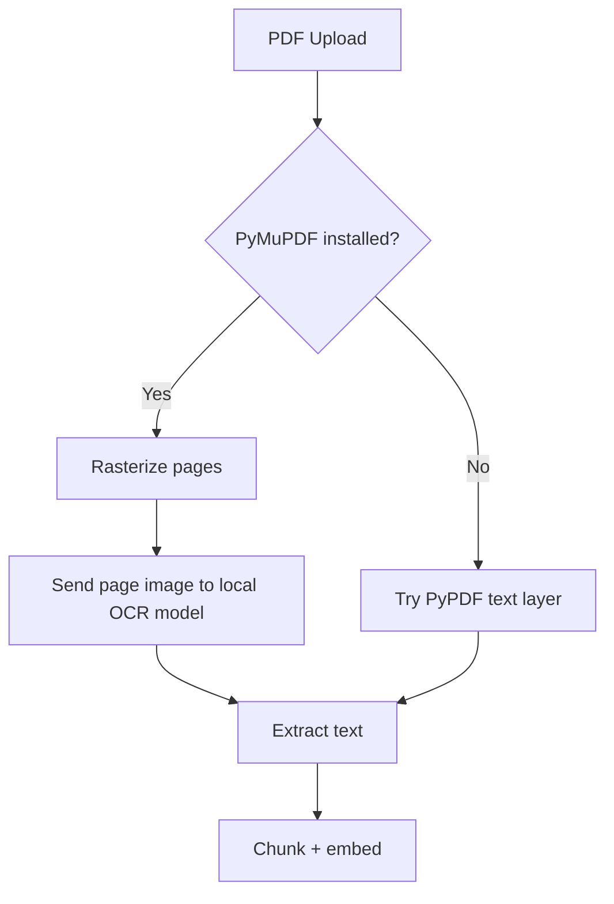
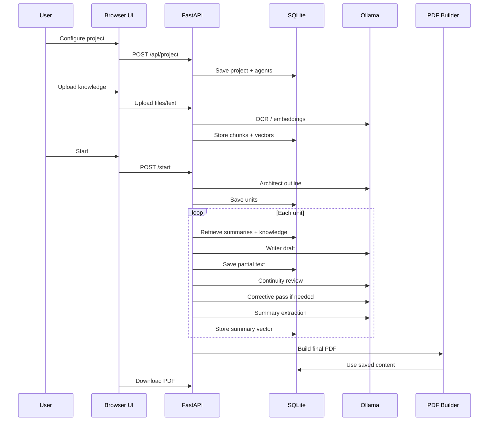

<!--
  README for: The Writer — Local Multi-Agent Autonomous Writing System
  Author: disavowed913
<p align="center">
  <h1 align="center">✍️ The Writer</h1>
  <p align="center">
    <strong>Local Multi-Agent Autonomous Writing System powered by Ollama</strong>
  </p>
  <p align="center">
    Generate novels, short stories, poetry collections, technical manuals, executive reports, market research reports, and more — fully offline, with local models, local OCR, project-scoped RAG memory, and professional PDF export.
  </p>
</p>
<p align="center">
  
  
  
  
  
  
</p>
<p align="center">
  <a href="#-quick-start">Quick Start</a> •
  <a href="#-what-this-project-does">Overview</a> •
  <a href="#-writing-modes">Writing Modes</a> •
  <a href="#-architecture">Architecture</a> •
  <a href="#-api-reference">API</a> •
  <a href="#-troubleshooting">Troubleshooting</a>
</p>
---
Created By
The Writer is created and maintained by disavowed913.
If this project helps you, please consider starring the repository and crediting the original author.
```text
Created by: disavowed913
Project: The Writer — Local Multi-Agent Autonomous Writing System
License: MIT
```
---
Table of Contents
What This Project Does
Why It Exists
Feature Highlights
Writing Modes
Document Type Engine
Interactive Browser UI
Architecture
Agent System
Knowledge Base and RAG
OCR Pipeline
PDF Generation
Project Structure
Requirements
Quick Start
Recommended Ollama Models
Configuration
API Reference
How Generation Works
Crash Resume
Privacy Model
Troubleshooting
Roadmap
License
---
What This Project Does
The Writer is a local autonomous writing platform that coordinates multiple Ollama models as functional writing agents. It can plan, draft, review, revise, track continuity, retrieve project knowledge, and export a polished PDF document without using external AI APIs.
It is built for serious long-form generation, not one-shot prompting.
Instead of asking one model to write an entire book in a single response, the system breaks the project into structured units such as chapters, stories, poems, or report sections. It then assigns work to different agents, stores progress in SQLite, retrieves relevant memory with embeddings, and continues until the full document is complete.
The result is a local writing engine that can generate:
full multi-chapter novels
short story collections
poetry collections
executive reports
technical manuals
academic-style papers
business proposals
market research reports
cyber threat intelligence reports
professional PDF documents
---
Why It Exists
Most AI writing tools have the same problems:
they depend on cloud APIs
they lose continuity after a few pages
they cannot reliably resume after failure
they mix unrelated project knowledge
they produce messy long documents
they require the user to keep prompting every step
they are not designed for local/offline writing workflows
The Writer solves these problems by combining:
Problem	Solution in The Writer
Model forgets earlier chapters	Project-scoped vector memory and chapter summaries
Long books lose continuity	Story bible, entity tracking, continuity review
Generation crashes	SQLite-backed resumable generation
Knowledge from one book leaks into another	Strict per-project knowledge base isolation
Scanned PDFs are hard to use	Local Ollama OCR pipeline
Reports need tables/charts/layout	Report-aware PDF rendering blocks
User must guide every step	Autonomous planning → writing → review → PDF export
Cloud dependence	Local Ollama models only
---
Feature Highlights
Core Writing Features
Multi-agent autonomous writing pipeline
Local Ollama model orchestration
Mode-specific prompt routing
Long-form generation across many units
Chapter/section/story/poem planning
Continuity validation
Corrective revision pass
Persistent chapter summaries
Story bible extraction for fiction modes
Local RAG memory retrieval
Automatic PDF compilation
Knowledge Features
Project-specific knowledge base
PDF ingestion
Image OCR
Scanned document OCR
TXT/Markdown ingestion
CSV/XLSX extraction
DOCX extraction
PPTX slide text extraction
JSON ingestion
Pasted text ingestion
Chunking and embedding
Source-tagged knowledge chunks
Knowledge export endpoint
Dashboard Features
Browser-based UI
No React, Streamlit, Gradio, or Electron
Vanilla HTML/CSS/JS frontend
Mode selector cards
Theme chips
Agent configuration rows
Local model discovery
Project list
Knowledge manager
Live progress panel
Chapter/section viewer
Recent log feed
PDF download button
System Features
SQLite persistence
Crash-resumable generation
Environment-variable configuration
PyInstaller-friendly base directory logic
Local-only OCR
Local-only embeddings with hash fallback
Ollama health checks
Model availability validation
Threaded generation runtime
Stop/resume support
Built-in REST API
---
Writing Modes
The system supports four main generation modes. Each mode changes how outlines are created, how text is generated, how review works, and how the PDF is formatted.
Mode	Internal Unit	Best For	Memory Behavior	Tables
`novel`	Chapter	Long-form fiction	Story bible + chapter summaries	Disabled by default
`short_story`	Story	Anthologies	Story bible + story summaries	Disabled by default
`poetry`	Poem	Poetry collections	Lightweight collection memory	Disabled
`report`	Section	Professional reports	Section summaries + knowledge retrieval	Enabled
Novel Mode
Novel mode is designed for full-length fiction. It creates a complete chapter-by-chapter architecture, then writes chapters one at a time while retrieving relevant earlier summaries and updating a story bible.
It tracks:
characters
locations
objects
world-building facts
plot threads
key events
chapter summaries
continuity notes
Short Story Mode
Short story mode generates a collection of standalone stories while preserving a consistent anthology tone. Each story is planned as an independent unit, but the collection can still share theme, genre, style, and author notes.
Poetry Mode
Poetry mode is optimized for shorter, form-aware literary pieces. It avoids report-style formatting and keeps the final PDF clean, spacious, and poetry-friendly.
Report Mode
Report mode is designed for structured professional documents. Unlike literary modes, report mode can use tables, timelines, KPI cards, callouts, charts, risk matrices, and other visual blocks when useful.
---
Document Type Engine
The project includes a dedicated document profile system. The profile engine decides which block types, fonts, styling rules, and formatting behaviors are appropriate for each document type.
Exposed Document Types
Document Type	Purpose
`novel`	Literary long-form fiction
`short_story_collection`	Standalone short story anthology
`poetry_collection`	Poetry collections with literary spacing
`executive_report`	Formal business and operational reports
`cyber_threat_intelligence_report`	CTI reports with IOC/CVE/MITRE-style structures
`technical_manual`	Setup guides, API references, troubleshooting docs
`academic_paper`	Academic-style papers with references, equations, captions
`business_proposal`	Scope, pricing, deliverables, timelines
`market_research_report`	Market sizing, competitors, SWOT, personas, trends
The profile module also contains additional profile definitions that can be enabled if you expand the API validator, such as legal briefs, incident response reports, investment memos, and narrative nonfiction.
---
Interactive Browser UI
The frontend is embedded directly inside the FastAPI app and served at:
```text
http://localhost:8000
```
The UI is designed as an offline writing dashboard with a tactical editorial look.
UI Sections
Area	Purpose
Header	Project identity and navigation
Health warning	Displays Ollama connection issues
Project setup	Title, genre, premise, mode, units, word target
Mode cards	Select Novel, Short Story, Poetry, or Report
Theme selector	Apply visual styles to the generated PDF and UI accent
Agent panel	Add architect, writer, and continuity agents
Knowledge panel	Upload files or paste project knowledge
Project table	Open, continue, or delete saved projects
Live status	Track writing phase, word count, progress, logs
Unit viewer	Read generated chapters/sections/stories/poems
PDF export	Download the compiled document
UI Design Philosophy
The UI avoids heavy frontend frameworks. This keeps the project simple, portable, and easy to run locally.
```text
FastAPI
  └── serves one embedded HTML page
        ├── CSS dashboard
        ├── vanilla JavaScript
        ├── REST API calls
        └── live project polling
```
---
Architecture

Runtime Components
Component	Responsibility
FastAPI app	Backend API, UI serving, generation control
SQLite database	Projects, agents, chapters, logs, vectors, knowledge docs
Ollama chat endpoint	Planning, writing, reviewing, summarizing
Ollama embeddings endpoint	Semantic retrieval for RAG memory
Hash embedding fallback	Keeps retrieval functional without embedding model
Ollama vision/OCR endpoint	Local OCR for images and scanned PDFs
ReportLab renderer	PDF generation and visual blocks
Vanilla JS frontend	Project creation, upload, polling, reading, export
---
Agent System
Agents are functional roles, not personas.
Each agent has:
a name
an Ollama model
a role
an execution order
Supported Roles
Role	Required	Responsibility
`architect`	Yes	Creates outlines, summaries, and story-bible extraction
`writer`	Yes	Writes each chapter/story/poem/section
`continuity`	Optional	Reviews output and flags contradictions or quality issues
Example Agent Setup
Agent Name	Role	Example Model
Architect	`architect`	`qwen2.5:7b`
Primary Writer	`writer`	`llama3.1:8b`
Reviewer	`continuity`	`mistral:7b`
Multiple writer agents are rotated using a round-robin scheduler.
---
Knowledge Base and RAG
Each project has its own isolated knowledge base. Every vector row is stored with a `project_id`, and retrieval always filters by that same project ID.
This means knowledge from one book cannot be retrieved by another book.
Supported Knowledge Inputs
Type	Support	Notes
PDF	Yes	Uses PyMuPDF OCR path or PyPDF text fallback
Images	Yes	PNG, JPG, JPEG, WEBP, GIF, BMP
Text files	Yes	TXT and Markdown
CSV	Yes	Batch upload endpoint
Excel	Yes	XLSX/XLSM via OpenPyXL
DOCX	Yes	Paragraphs and tables via python-docx
PPTX	Yes	Slide text and notes via python-pptx
JSON	Yes	Pretty-printed and chunked
Pasted text	Yes	Stored as a knowledge document
RAG Flow

Why Project-Scoped RAG Matters
For long-form writing, memory contamination is a real problem. A fantasy novel should not accidentally retrieve knowledge from a cyber threat report. A business proposal should not reuse details from a previous poetry collection.
The Writer prevents this by treating every project as a separate memory universe.
---
OCR Pipeline
OCR is local and optional, but strongly recommended for knowledge-heavy projects.
Recommended OCR model:
```bash
ollama pull glm-ocr:q8_0
```
PDF OCR Flow

If a PDF is scanned and PyMuPDF is not installed, text extraction may fail. Keep PyMuPDF installed for best results.
---
PDF Generation
The Writer uses ReportLab to create the final PDF.
PDF Features
cover page
title styling
mode-aware layouts
chapter/section breaks
page numbers
professional headings
theme-aware color palettes
literary formatting for fiction/poetry
report formatting for structured documents
tables
callout boxes
KPI cards
timelines
IOC tables
code blocks
basic chart rendering
Themes
Theme	Best For
`classic_cream`	Novels, literary manuscripts
`midnight_gothic`	Dark/gothic fiction
`rose_poetics`	Poetry collections
`modern_corporate`	Executive and business reports
`minimal_mono`	Technical manuals and academic papers
`tactical_dark`	CTI and security reports
`deep_navy`	Professional corporate documents
`warm_editorial`	Editorial essays and nonfiction
`charcoal_ink`	Clean monochrome reports
Literary modes intentionally avoid corporate report decor even if a corporate theme is selected.
---
Project Structure
Recommended repository layout:
```text
the-writer/
├── the_writer.py              # Main FastAPI + Ollama + UI + PDF runtime
├── document_profiles.py       # Document type rules, fonts, blocks, detection
├── requirements.txt           # Python dependencies
├── README.md                  # Project documentation
├── LICENSE                    # MIT License
├── generated_pdfs/            # Created automatically at runtime
├── fonts/                     # Optional custom .ttf/.otf fonts
└── .gitignore
```
Suggested `.gitignore`:
```gitignore
__pycache__/
*.pyc
*.db
*.log
generated_pdfs/
.env
.venv/
.DS_Store
```
The main app imports `document_profiles.py`, so both files must be in the same directory unless you change the import path.
---
Requirements
Python
Use Python 3.10+.
The project uses modern typing syntax and Pydantic v2 validators.
Python Packages
Install with:
```bash
pip install -r requirements.txt
```
The generated `requirements.txt` contains:
```txt
fastapi>=0.110.0
uvicorn[standard]>=0.29.0
pydantic>=2.5.0
requests>=2.31.0
numpy>=1.24.0
reportlab>=4.0.0
python-multipart>=0.0.9
pypdf>=4.0.0
PyMuPDF>=1.23.0
python-docx>=1.1.0
python-pptx>=0.6.23
openpyxl>=3.1.0
```
System Requirements
Requirement	Recommended
RAM	16 GB minimum, 32 GB recommended for larger models
Storage	10 GB+ free for models and generated documents
CPU	Modern multi-core CPU
GPU	Optional but strongly recommended for large local models
Ollama	Must be installed and running
---
Quick Start
1. Clone the Repository
```bash
git clone https://github.com/YOUR_USERNAME/the-writer.git
cd the-writer
```
2. Create a Virtual Environment
```bash
python3 -m venv .venv
source .venv/bin/activate
```
On Windows PowerShell:
```powershell
python -m venv .venv
.\.venv\Scripts\Activate.ps1
```
3. Install Dependencies
```bash
pip install --upgrade pip
pip install -r requirements.txt
```
On externally-managed Linux environments, you may need:
```bash
pip install -r requirements.txt --break-system-packages
```
Using a virtual environment is cleaner and recommended.
4. Start Ollama
```bash
ollama serve
```
5. Pull Models
At minimum, pull one writing model:
```bash
ollama pull llama3.1:8b
```
Recommended extras:
```bash
ollama pull nomic-embed-text
ollama pull glm-ocr:q8_0
```
6. Run the App
```bash
python the_writer.py
```
7. Open the Dashboard
```text
http://localhost:8000
```
---
Recommended Ollama Models
These are examples. You can use any locally installed Ollama-compatible model.
Task	Recommended Model Type	Notes
Architect planning	Strong reasoning model	Better outlines and report structure
Long-form writing	Strong instruction/writing model	Better prose and section drafting
Continuity review	Fast reasoning model	Good for contradiction checks
Embeddings	`nomic-embed-text`	Recommended for RAG retrieval
OCR	`glm-ocr:q8_0`	Recommended for local OCR
Example setup:
```text
Architect Agent  → qwen2.5:7b
Writer Agent     → llama3.1:8b
Reviewer Agent   → mistral:7b
Embedding Model  → nomic-embed-text
OCR Model        → glm-ocr:q8_0
```
---
Configuration
The app is configured through environment variables.
Variable	Default	Purpose
`OLLAMA_URL`	`http://localhost:11434`	Ollama daemon URL
`PRESS_DB_PATH`	`./the_writer.db`	SQLite database path
`PRESS_PDF_DIR`	`./generated_pdfs`	PDF output directory
`PRESS_LOG_PATH`	`./the_writer.log`	Log file path
`PRESS_PORT`	`8000`	FastAPI server port
`PRESS_OCR_MODEL`	`glm-ocr:q8_0`	Default OCR model
`PRESS_FONT_DIR`	`./fonts`	Optional custom font directory
Example:
```bash
export PRESS_PORT=9000
export OLLAMA_URL=http://localhost:11434
export PRESS_DB_PATH=/data/the_writer.db
python the_writer.py
```
---
API Reference
The dashboard uses the same REST API exposed by the backend.
System
Method	Endpoint	Description
GET	`/api/health`	Check Ollama connection and list models
GET	`/api/ollama/models`	List local Ollama models
GET	`/api/modes`	Return writing modes, themes, document types, OCR support
GET	`/`	Serve the browser UI
Projects
Method	Endpoint	Description
GET	`/api/projects`	List projects
POST	`/api/project`	Create a project
GET	`/api/project/{project_id}`	Read project details
DELETE	`/api/project/{project_id}`	Delete project and generated PDF
POST	`/api/project/{project_id}/start`	Start or resume generation
POST	`/api/project/{project_id}/stop`	Request stop
GET	`/api/project/{project_id}/status`	Get progress, status, logs, percentage
Units
Internally, the app stores chapters, stories, poems, and report sections in a shared `chapters` table.
Method	Endpoint	Description
GET	`/api/project/{project_id}/chapters`	List generated units
GET	`/api/project/{project_id}/chapter/{idx}`	Read one generated unit
GET	`/api/project/{project_id}/pdf`	Build/download PDF
Knowledge Base
Method	Endpoint	Description
GET	`/api/project/{project_id}/knowledge`	List knowledge documents
POST	`/api/project/{project_id}/knowledge/upload`	Upload one PDF/image/text/Markdown file
POST	`/api/project/{project_id}/knowledge/upload-batch`	Upload multiple supported files
POST	`/api/project/{project_id}/knowledge/paste`	Add pasted text
GET	`/api/project/{project_id}/knowledge/stats`	Knowledge base statistics
GET	`/api/project/{project_id}/knowledge/export`	Export stored knowledge chunks
DELETE	`/api/project/{project_id}/knowledge/{doc_id}`	Delete one knowledge document
DELETE	`/api/project/{project_id}/knowledge`	Clear project knowledge base
Document Detection
Method	Endpoint	Description
GET	`/api/detect_doc_type`	Detect best document profile from title, genre, premise, and notes
---
How Generation Works
The generation process is fully autonomous after setup.

Fresh Project Path
Validate project and agent configuration.
Check Ollama health.
Verify required models exist locally.
Retrieve relevant knowledge based on premise.
Architect agent creates a structured outline.
Outline is parsed into units.
Units are written one by one.
Summaries and memory vectors are stored after each unit.
PDF is compiled after all units are complete.
Resume Path
If units already exist in the database, the app does not start over. It reloads the outline from saved unit rows and continues from the first incomplete unit.
---
Crash Resume
The app is designed to survive interruptions.
During writing, content is saved after each generation pass. If the process dies while writing a long unit, restarting the app and clicking Start again will continue from the saved text instead of losing the entire project.
Stored state includes:
project config
agents
outline units
partial unit content
word count
status
logs
summaries
knowledge vectors
story bible entities
---
Privacy Model
The Writer is local-first by design.
Data	Where It Goes
Prompts	Local Ollama endpoint
Uploaded documents	Local process only
OCR images	Local Ollama OCR model
Embeddings	Local Ollama embedding model or local hash fallback
Project database	Local SQLite file
PDFs	Local output directory
Logs	Local log file
No external AI API is called by the application code.
---
Custom Fonts
The app supports optional custom fonts through the `fonts/` directory.
Add `.ttf` or `.otf` files:
```text
fonts/
├── CormorantGaramond-Regular.ttf
├── Inter-Regular.ttf
└── JetBrainsMono-Regular.ttf
```
Then restart the app. The PDF renderer attempts to register local font files and falls back to ReportLab-safe fonts when a preferred font is unavailable.
---
Example Use Cases
Generate a Novel
```text
Mode: Novel
Genre: Dystopian science fiction
Units: 24 chapters
Words per unit: 2500
Theme: Classic Cream
Agents:
  - Architect: qwen2.5:7b
  - Writer: llama3.1:8b
  - Continuity: mistral:7b
Knowledge:
  - worldbuilding notes
  - character sheets
  - timeline document
```
Generate a Cyber Threat Intelligence Report
```text
Mode: Report
Document Type: Cyber Threat Intelligence Report
Units: 8 sections
Words per unit: 900
Theme: Tactical Dark
Knowledge:
  - IOC CSV
  - incident notes
  - screenshots
  - source PDFs
```
Generate a Market Research Report
```text
Mode: Report
Document Type: Market Research Report
Units: 7 sections
Words per unit: 800
Theme: Modern Corporate
Knowledge:
  - competitor notes
  - pricing spreadsheet
  - survey results
  - product screenshots
```
---
Development Notes
Why SQLite?
SQLite keeps the project portable and simple. It stores everything needed for resume and retrieval without requiring a separate database server.
Tables include:
`projects`
`agents`
`chapters`
`vectors`
`logs`
`entities`
`knowledge_docs`
Why ReportLab?
ReportLab gives direct control over PDF layout, typography, tables, drawings, charts, and page templates without requiring a browser renderer.
Why Vanilla HTML/CSS/JS?
The project stays easy to run, inspect, modify, and package. There is no frontend build system and no Node.js dependency.
---
Troubleshooting
Ollama is not reachable
Make sure Ollama is running:
```bash
ollama serve
```
Then check:
```bash
curl http://localhost:11434/api/tags
```
If Ollama is running on another host or port:
```bash
export OLLAMA_URL=http://127.0.0.1:11434
python the_writer.py
```
Model not found
Pull the missing model:
```bash
ollama pull llama3.1:8b
```
The app validates agent models before generation begins.
PDF OCR fails
Install PyMuPDF and make sure the OCR model is available:
```bash
pip install PyMuPDF
ollama pull glm-ocr:q8_0
```
Uploads fail
Make sure `python-multipart` is installed:
```bash
pip install python-multipart
```
Pydantic validator error
The app uses Pydantic v2. Install or upgrade it:
```bash
pip install "pydantic>=2.5.0"
```
ReportLab font issues
If custom fonts fail, the app falls back to default ReportLab fonts. Make sure your font files are valid `.ttf` or `.otf` files.
Very slow generation
Local LLMs can be slow for long chapters. Try:
fewer units
lower words per unit
a smaller model
a faster quantized model
GPU acceleration
using a smaller OCR batch
---
Security and Safety Notes
The project is designed as a local writing system. Uploaded files are processed locally and stored in the local SQLite database as extracted text chunks.
Be careful when:
uploading private documents
sharing the SQLite database
committing logs or generated PDFs
exposing the FastAPI port on a public network
The server binds to `0.0.0.0` by default in the script. For local-only use, you may change the final `uvicorn.run` host to `127.0.0.1`.
---
Packaging Notes
The app includes logic for frozen/PyInstaller execution. If packaged into a single executable, it stores the database, logs, and PDFs beside the executable instead of inside the temporary unpack directory.
Example PyInstaller direction:
```bash
pip install pyinstaller
pyinstaller --onefile the_writer.py
```
If you use PyInstaller, make sure `document_profiles.py` is included and test file upload/OCR behavior carefully.
---
Roadmap
Planned or recommended improvements:
DOCX export
Markdown export
EPUB export
better PDF cover templates
model benchmark panel
per-agent temperature settings
queue system for multiple projects
richer citation handling for knowledge chunks
document preview before PDF build
editable generated units
manual re-run for a selected chapter/section
export/import project archive
improved chart renderer
native bibliography manager
custom theme editor
profile editor for new document types
---
Contributing
Contributions are welcome.
Good areas to contribute:
new document profiles
better PDF layouts
more visual block renderers
export formats
UI polish
model presets
OCR improvements
packaging scripts
tests
documentation
Suggested workflow:
```bash
fork the repo
create a feature branch
make changes
run locally
open a pull request
```
---
License
This project is released under the MIT License.
```text
MIT License

Copyright (c) 2026 disavowed913
```
You are free to use, modify, distribute, and build on this project, including for commercial use, as long as the original copyright notice and license are included.
---
Star the Project
If The Writer helps you build books, reports, research documents, or offline AI writing workflows, please support the project:
Star the repository
Fork it
Share it with builders

<p align="center">
  <strong>Built locally. Written autonomously. Owned by the creator.</strong>
</p>
