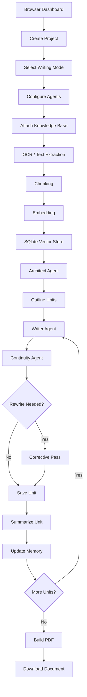
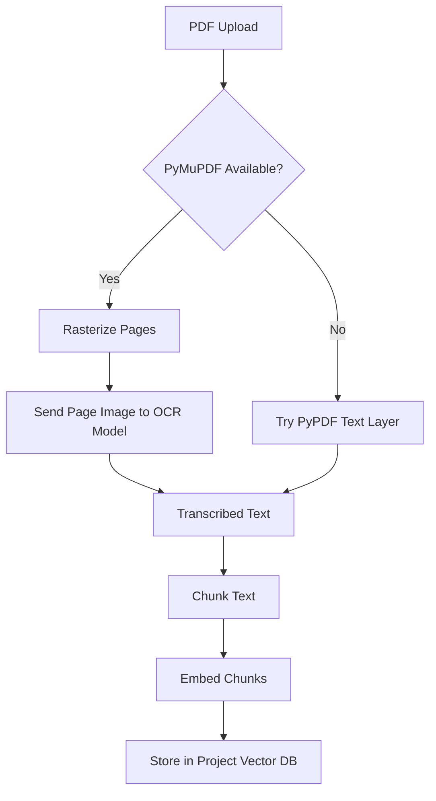
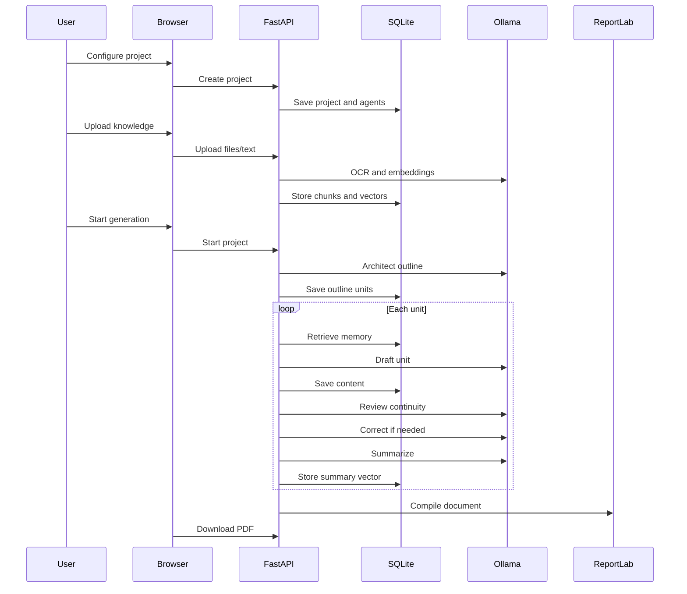

# ✍️ The Writer

<p align="center">
  <strong>Local Multi-Agent Autonomous Writing System powered by Ollama</strong>
</p>

<p align="center">
  Generate novels, short stories, poetry collections, executive reports, technical manuals, market research reports, CTI reports, and professional PDFs — fully offline with local LLMs, local OCR, project-scoped RAG memory, and crash-resumable generation.
</p>

<p align="center">
  
  
  
  
  
  
</p>

<p align="center">
  <a href="#-quick-start">Quick Start</a>
  ·
  <a href="#-features">Features</a>
  ·
  <a href="#-writing-modes">Writing Modes</a>
  ·
  <a href="#-architecture">Architecture</a>
  ·
  <a href="#-api-reference">API</a>
  ·
  <a href="#-troubleshooting">Troubleshooting</a>
</p>

---

## 👤 Author

**Created and maintained by `disavowed913`**

```text
Project: The Writer — Local Multi-Agent Autonomous Writing System
Author: disavowed913
License: MIT
```

---

## 📌 Table of Contents

* [Overview](#-overview)
* [Features](#-features)
* [Writing Modes](#-writing-modes)
* [Document Type Engine](#-document-type-engine)
* [Interactive Browser UI](#-interactive-browser-ui)
* [Architecture](#-architecture)
* [Agent System](#-agent-system)
* [Knowledge Base](#-knowledge-base)
* [RAG Memory](#-rag-memory)
* [OCR Pipeline](#-ocr-pipeline)
* [PDF Generation](#-pdf-generation)
* [Project Structure](#-project-structure)
* [Requirements](#-requirements)
* [Quick Start](#-quick-start)
* [Recommended Models](#-recommended-models)
* [Configuration](#-configuration)
* [API Reference](#-api-reference)
* [Generation Flow](#-generation-flow)
* [Crash Resume](#-crash-resume)
* [Privacy Model](#-privacy-model)
* [Custom Fonts](#-custom-fonts)
* [Example Workflows](#-example-workflows)
* [Troubleshooting](#-troubleshooting)
* [Security Notes](#-security-notes)
* [Roadmap](#-roadmap)
* [License](#-license)

---

## 🧠 Overview

**The Writer** is a fully local autonomous writing platform that coordinates multiple Ollama models as functional writing agents.

It is built for long-form generation, structured document creation, professional PDF export, and offline AI-assisted writing workflows.

The system breaks a project into controlled writing units, stores progress in SQLite, retrieves relevant project memory with embeddings, updates summaries and story-bible data, runs review passes, and compiles the final output into a polished PDF.

```text
One project
    ↓
Multiple local agents
    ↓
Outline generation
    ↓
Unit-by-unit writing
    ↓
RAG memory retrieval
    ↓
Continuity review
    ↓
Revision pass
    ↓
PDF export
```

---

## ✨ Features

### Core System

| Feature                          | Status |
| -------------------------------- | ------ |
| Local Ollama model orchestration | ✅      |
| Multi-agent autonomous writing   | ✅      |
| FastAPI backend                  | ✅      |
| Embedded browser dashboard       | ✅      |
| Vanilla HTML/CSS/JS frontend     | ✅      |
| SQLite persistence               | ✅      |
| Crash-resumable generation       | ✅      |
| Local-only execution             | ✅      |
| REST API                         | ✅      |
| Project deletion and cleanup     | ✅      |
| Live logs and status polling     | ✅      |

### Writing Features

| Feature                                  | Status |
| ---------------------------------------- | ------ |
| Novel generation                         | ✅      |
| Short story collection generation        | ✅      |
| Poetry collection generation             | ✅      |
| Executive report generation              | ✅      |
| Technical manual support                 | ✅      |
| Academic paper support                   | ✅      |
| Market research report support           | ✅      |
| Cyber threat intelligence report support | ✅      |
| Business proposal support                | ✅      |
| Chapter/section/story/poem planning      | ✅      |
| Continuity review                        | ✅      |
| Corrective rewrite pass                  | ✅      |
| Unit summaries                           | ✅      |
| Story bible extraction                   | ✅      |
| Entity tracking                          | ✅      |

### Knowledge Features

| Input Type  | Support |
| ----------- | ------- |
| PDF         | ✅       |
| Scanned PDF | ✅       |
| Images      | ✅       |
| Screenshots | ✅       |
| TXT         | ✅       |
| Markdown    | ✅       |
| CSV         | ✅       |
| XLSX / XLSM | ✅       |
| DOCX        | ✅       |
| PPTX        | ✅       |
| JSON        | ✅       |
| Pasted text | ✅       |

### Export Features

| Export          | Status  |
| --------------- | ------- |
| PDF             | ✅       |
| DOCX            | Planned |
| Markdown        | Planned |
| EPUB            | Planned |
| Project archive | Planned |

---

## 📚 Writing Modes

| Mode          | Internal Unit | Best For             | Memory                        | Tables   |
| ------------- | ------------: | -------------------- | ----------------------------- | -------- |
| `novel`       |       Chapter | Long-form fiction    | Story bible + summaries       | Disabled |
| `short_story` |         Story | Anthologies          | Story bible + summaries       | Disabled |
| `poetry`      |          Poem | Poetry collections   | Lightweight collection memory | Disabled |
| `report`      |       Section | Professional reports | Section summaries + RAG       | Enabled  |

---

## 📖 Novel Mode

Novel mode creates full chapter-by-chapter long-form fiction.

It tracks:

* Characters
* Locations
* Objects
* World-building facts
* Plot threads
* Chapter summaries
* Key events
* Continuity notes
* Tone and setting
* Point-of-view metadata

```text
Premise
  ↓
Architecture
  ↓
Chapter outline
  ↓
Chapter draft
  ↓
Continuity review
  ↓
Revision
  ↓
Story bible update
  ↓
Memory vector storage
```

---

## 📘 Short Story Mode

Short story mode generates anthology-style collections.

It supports:

* Independent stories
* Shared collection tone
* Thematic consistency
* Standalone endings
* Story summaries
* Collection-level continuity

---

## ✒️ Poetry Mode

Poetry mode generates form-aware poetry collections.

It supports:

* Free verse
* Thematic collections
* Literary spacing
* Minimal layout
* Wide whitespace
* Clean poetry-first PDF styling

---

## 📊 Report Mode

Report mode generates professional structured documents.

It supports:

* Executive summaries
* Tables
* KPI cards
* Timelines
* Callout boxes
* Charts
* Risk matrices
* Comparison matrices
* Technical sections
* Appendices
* Source notes

---

## 🧩 Document Type Engine

The document profile system controls:

* Allowed blocks
* Disallowed blocks
* Fonts
* Theme defaults
* Layout behavior
* Content rules
* Report/literary formatting boundaries

### Supported Document Types

| Document Type                      | Purpose                                       |
| ---------------------------------- | --------------------------------------------- |
| `novel`                            | Long-form fiction                             |
| `short_story_collection`           | Short story anthology                         |
| `poetry_collection`                | Poetry collections                            |
| `executive_report`                 | Business and operational reports              |
| `cyber_threat_intelligence_report` | CTI reports with IOC/CVE/MITRE blocks         |
| `technical_manual`                 | Setup guides, API docs, troubleshooting       |
| `academic_paper`                   | Academic papers with references and equations |
| `business_proposal`                | Scope, pricing, deliverables, timelines       |
| `market_research_report`           | Competitors, SWOT, personas, market sizing    |

---

## 🖥 Interactive Browser UI

The dashboard is served directly from FastAPI.

```text
http://localhost:8000
```

### UI Areas

| Area            | Purpose                                        |
| --------------- | ---------------------------------------------- |
| Header          | Project identity and system status             |
| Health warning  | Ollama connection and model status             |
| Project setup   | Title, genre, premise, units, word target      |
| Mode selector   | Novel, short story, poetry, report             |
| Theme selector  | PDF and UI styling                             |
| Agent panel     | Add architect, writer, reviewer agents         |
| Knowledge panel | Upload files or paste knowledge                |
| Project table   | Open, resume, delete projects                  |
| Live status     | Progress, phase, word count, logs              |
| Unit viewer     | Read generated chapters/sections/poems/stories |
| PDF export      | Build and download final PDF                   |

### Frontend Stack

```text
FastAPI
  └── Embedded HTML
      ├── CSS
      ├── Vanilla JavaScript
      ├── REST API calls
      └── Live polling
```

---

## 🏗 Architecture



---

## ⚙️ Runtime Components

| Component         | Responsibility                           |
| ----------------- | ---------------------------------------- |
| FastAPI           | Backend, API, UI serving                 |
| SQLite            | Projects, agents, units, logs, vectors   |
| Ollama Chat       | Planning, writing, review, summarization |
| Ollama Embeddings | Semantic retrieval                       |
| Hash Embeddings   | Local fallback retrieval                 |
| Ollama Vision/OCR | Local OCR for images and scanned PDFs    |
| ReportLab         | PDF generation                           |
| PyMuPDF           | PDF rasterization                        |
| PyPDF             | Text-layer PDF extraction                |
| python-docx       | DOCX ingestion                           |
| python-pptx       | PPTX ingestion                           |
| openpyxl          | Spreadsheet ingestion                    |
| Vanilla JS        | Dashboard interaction and polling        |

---

## 🤖 Agent System

Agents are functional roles.

No personas.

No roleplay.

No external APIs.

### Agent Fields

| Field       | Description        |
| ----------- | ------------------ |
| `name`      | Display name       |
| `model`     | Local Ollama model |
| `role`      | Functional role    |
| `order_idx` | Execution order    |

### Supported Roles

| Role         | Required | Responsibility                     |
| ------------ | -------: | ---------------------------------- |
| `architect`  |        ✅ | Creates outlines and structure     |
| `writer`     |        ✅ | Writes units                       |
| `continuity` | Optional | Reviews contradictions and quality |

### Example Agent Setup

| Agent          | Role         | Model         |
| -------------- | ------------ | ------------- |
| Architect      | `architect`  | `qwen2.5:7b`  |
| Primary Writer | `writer`     | `llama3.1:8b` |
| Reviewer       | `continuity` | `mistral:7b`  |

---

## 🗂 Knowledge Base

Every project owns an isolated knowledge base.

Knowledge never crosses projects.

### Supported Knowledge Sources

| Source      | Extraction Method              |
| ----------- | ------------------------------ |
| PDF         | OCR or text-layer extraction   |
| Image       | Local OCR model                |
| TXT         | Direct text decode             |
| Markdown    | Direct text decode             |
| CSV         | Structured row extraction      |
| XLSX        | Sheet extraction               |
| DOCX        | Paragraph and table extraction |
| PPTX        | Slide text and notes           |
| JSON        | Pretty-print and chunk         |
| Pasted text | Direct storage                 |

### Storage Model

```text
knowledge_docs
    ├── id
    ├── project_id
    ├── filename
    ├── source_type
    ├── char_count
    ├── chunk_count
    ├── status
    └── error

vectors
    ├── id
    ├── project_id
    ├── chapter_idx
    ├── kind
    ├── text
    ├── embedding
    ├── dim
    └── doc_id
```

---

## 📑 RAG Memory

The Writer uses Retrieval-Augmented Generation for project memory.

### RAG Flow


### Memory Types

| Type               | Purpose                            |
| ------------------ | ---------------------------------- |
| `knowledge`        | Uploaded/pasted reference material |
| `chapter_summary`  | Past unit summaries                |
| `story_bible`      | Fiction entity memory              |
| `continuity_notes` | Review and correction memory       |

---

## 🔍 OCR Pipeline

OCR is fully local through Ollama.

Recommended model:

```bash
ollama pull glm-ocr:q8_0
```

### PDF OCR Flow



### Image OCR Flow

```text
Image
  ↓
Base64 encode
  ↓
Ollama vision/OCR model
  ↓
Transcribed text
  ↓
Chunk
  ↓
Embed
  ↓
Store
```

---

## 🧾 PDF Generation

The Writer uses ReportLab for PDF export.

### PDF Features

| Feature             | Support |
| ------------------- | ------- |
| Cover page          | ✅       |
| Page numbers        | ✅       |
| Chapter breaks      | ✅       |
| Section headings    | ✅       |
| Literary formatting | ✅       |
| Report formatting   | ✅       |
| Tables              | ✅       |
| KPI cards           | ✅       |
| Callout boxes       | ✅       |
| Timelines           | ✅       |
| Code blocks         | ✅       |
| Basic charts        | ✅       |
| Theme colors        | ✅       |
| Custom fonts        | ✅       |

### Themes

| Theme              | Best For             |
| ------------------ | -------------------- |
| `classic_cream`    | Novels, manuscripts  |
| `midnight_gothic`  | Gothic/dark fiction  |
| `rose_poetics`     | Poetry               |
| `modern_corporate` | Business reports     |
| `minimal_mono`     | Technical manuals    |
| `tactical_dark`    | CTI/security reports |
| `deep_navy`        | Corporate reports    |
| `warm_editorial`   | Editorial nonfiction |
| `charcoal_ink`     | Monochrome reports   |


---

## 📦 Requirements

### Python

```text
Python 3.10+
```

### `requirements.txt`

```txt
fastapi>=0.110.0
uvicorn[standard]>=0.29.0
pydantic>=2.5.0
requests>=2.31.0
numpy>=1.24.0
reportlab>=4.0.0
python-multipart>=0.0.9
pypdf>=4.0.0
PyMuPDF>=1.23.0
python-docx>=1.1.0
python-pptx>=0.6.23
openpyxl>=3.1.0
```

### System Requirements

| Resource | Recommended                            |
| -------- | -------------------------------------- |
| RAM      | 16 GB minimum, 32 GB recommended       |
| Storage  | 10 GB+ free                            |
| CPU      | Modern multi-core                      |
| GPU      | Optional, recommended for large models |
| Ollama   | Installed and running                  |

---

## 🚀 Quick Start

### 1. Clone

```bash
git clone https://github.com/YOUR_USERNAME/the-writer.git
cd 'The Writer'
```

### 2. Create Virtual Environment

```bash
python3 -m venv .venv
source .venv/bin/activate
```

### 3. Install Dependencies

```bash
pip install --upgrade pip
pip install -r requirements.txt
```

Linux externally-managed environments:

```bash
pip install -r requirements.txt --break-system-packages
```

### 4. Start Ollama

```bash
ollama serve
```

### 5. Pull Models

Minimum:

```bash
ollama pull llama3.1:8b
```

Recommended:

```bash
ollama pull nomic-embed-text
ollama pull glm-ocr:q8_0
```

### 6. Run

```bash
cd app
python3 book.py
```

### 7. Open

```text
http://localhost:8000
```

---

## 🧠 Recommended Models

| Task       | Suggested Model                           |
| ---------- | ----------------------------------------- |
| Planning   | `qwen2.5:7b`, `qwen3`, `deepseek-r1`      |
| Writing    | `llama3.1:8b`, `qwen2.5:7b`, `mistral:7b` |
| Review     | `mistral:7b`, `gemma`, `qwen2.5`          |
| Embeddings | `nomic-embed-text`                        |
| OCR        | `glm-ocr:q8_0`                            |

### Example Configuration

```text
Architect Agent  → qwen2.5:7b
Writer Agent     → llama3.1:8b
Reviewer Agent   → mistral:7b
Embedding Model  → nomic-embed-text
OCR Model        → glm-ocr:q8_0
```

---

## ⚙️ Configuration

| Variable          | Default                  | Purpose               |
| ----------------- | ------------------------ | --------------------- |
| `OLLAMA_URL`      | `http://localhost:11434` | Ollama daemon URL     |
| `PRESS_DB_PATH`   | `./the_writer.db`        | SQLite database path  |
| `PRESS_PDF_DIR`   | `./generated_pdfs`       | PDF output directory  |
| `PRESS_LOG_PATH`  | `./the_writer.log`       | Log file path         |
| `PRESS_PORT`      | `8000`                   | Server port           |
| `PRESS_OCR_MODEL` | `glm-ocr:q8_0`           | Default OCR model     |
| `PRESS_FONT_DIR`  | `./fonts`                | Custom font directory |

### Example

```bash
export PRESS_PORT=9000
export OLLAMA_URL=http://localhost:11434
export PRESS_DB_PATH=/data/the_writer.db
cd app
python3 book.py
```

---

## 🔌 API Reference

### System

| Method | Endpoint             | Description                    |
| ------ | -------------------- | ------------------------------ |
| `GET`  | `/`                  | Browser UI                     |
| `GET`  | `/api/health`        | Ollama health and model status |
| `GET`  | `/api/ollama/models` | Local Ollama model list        |
| `GET`  | `/api/modes`         | Modes, themes, document types  |

### Projects

| Method   | Endpoint                           | Description             |
| -------- | ---------------------------------- | ----------------------- |
| `GET`    | `/api/projects`                    | List projects           |
| `POST`   | `/api/project`                     | Create project          |
| `GET`    | `/api/project/{project_id}`        | Project details         |
| `DELETE` | `/api/project/{project_id}`        | Delete project          |
| `POST`   | `/api/project/{project_id}/start`  | Start/resume generation |
| `POST`   | `/api/project/{project_id}/stop`   | Stop generation         |
| `GET`    | `/api/project/{project_id}/status` | Progress and logs       |

### Units

| Method | Endpoint                                  | Description        |
| ------ | ----------------------------------------- | ------------------ |
| `GET`  | `/api/project/{project_id}/chapters`      | List units         |
| `GET`  | `/api/project/{project_id}/chapter/{idx}` | Read unit          |
| `GET`  | `/api/project/{project_id}/pdf`           | Build/download PDF |

### Knowledge

| Method   | Endpoint                                           | Description             |
| -------- | -------------------------------------------------- | ----------------------- |
| `GET`    | `/api/project/{project_id}/knowledge`              | List knowledge docs     |
| `POST`   | `/api/project/{project_id}/knowledge/upload`       | Upload one file         |
| `POST`   | `/api/project/{project_id}/knowledge/upload-batch` | Upload multiple files   |
| `POST`   | `/api/project/{project_id}/knowledge/paste`        | Add pasted text         |
| `GET`    | `/api/project/{project_id}/knowledge/stats`        | Knowledge stats         |
| `GET`    | `/api/project/{project_id}/knowledge/export`       | Export knowledge chunks |
| `DELETE` | `/api/project/{project_id}/knowledge/{doc_id}`     | Delete one doc          |
| `DELETE` | `/api/project/{project_id}/knowledge`              | Clear knowledge base    |

### Document Detection

| Method | Endpoint               | Description                  |
| ------ | ---------------------- | ---------------------------- |
| `GET`  | `/api/detect_doc_type` | Detect best document profile |

---

## 🔄 Generation Flow



---

## 🧱 Database Tables

| Table            | Purpose                                      |
| ---------------- | -------------------------------------------- |
| `projects`       | Project metadata and progress                |
| `agents`         | Agent configuration                          |
| `chapters`       | Chapters, stories, poems, or report sections |
| `vectors`        | RAG embeddings                               |
| `logs`           | Runtime logs                                 |
| `entities`       | Story bible facts                            |
| `knowledge_docs` | Uploaded/pasted knowledge metadata           |

---

## 🛟 Crash Resume

Stored state:

* Project config
* Agents
* Outline units
* Partial unit content
* Word count
* Status
* Logs
* Summaries
* Knowledge vectors
* Story bible entities

Resume behavior:

```text
Start clicked
  ↓
Project exists
  ↓
Units already saved?
  ↓
Continue from first incomplete unit
  ↓
Preserve completed content
```

---

## 🔒 Privacy Model

| Data           | Destination                   |
| -------------- | ----------------------------- |
| Prompts        | Local Ollama                  |
| Uploaded files | Local process                 |
| OCR images     | Local Ollama OCR              |
| Embeddings     | Local Ollama or hash fallback |
| Database       | Local SQLite                  |
| PDFs           | Local output directory        |
| Logs           | Local log file                |

```text
No external AI APIs.
No cloud inference.
No remote vector database.
No third-party OCR.
No external storage.
```

---

## 🔤 Custom Fonts

Place `.ttf` or `.otf` files in:

```text
fonts/
```

Example:

```text
fonts/
├── CormorantGaramond-Regular.ttf
├── Inter-Regular.ttf
├── JetBrainsMono-Regular.ttf
└── SourceSans3-Regular.ttf
```

The renderer attempts to register local fonts and falls back to ReportLab-safe fonts.

---

## 🧪 Example Workflows

### Novel

```text
Mode: Novel
Genre: Dystopian science fiction
Units: 24 chapters
Words per unit: 2500
Theme: Classic Cream

Agents:
  - Architect: qwen2.5:7b
  - Writer: llama3.1:8b
  - Reviewer: mistral:7b

Knowledge:
  - Worldbuilding notes
  - Character sheets
  - Timeline document
```

### Cyber Threat Intelligence Report

```text
Mode: Report
Document Type: Cyber Threat Intelligence Report
Units: 8 sections
Words per unit: 900
Theme: Tactical Dark

Knowledge:
  - IOC CSV
  - Incident notes
  - Screenshots
  - Source PDFs
```

### Market Research Report

```text
Mode: Report
Document Type: Market Research Report
Units: 7 sections
Words per unit: 800
Theme: Modern Corporate

Knowledge:
  - Competitor notes
  - Pricing spreadsheet
  - Survey results
  - Product screenshots
```

### Poetry Collection

```text
Mode: Poetry
Units: 40 poems
Words per unit: 150
Theme: Rose Poetics

Knowledge:
  - Theme notes
  - Personal fragments
  - Style references
```

---

## 🛠 Troubleshooting

### Ollama Not Reachable

```bash
ollama serve
```

```bash
curl http://localhost:11434/api/tags
```

Custom Ollama URL:

```bash
export OLLAMA_URL=http://127.0.0.1:11434
python the_writer.py
```

### Model Not Found

```bash
ollama pull llama3.1:8b
```

### OCR Fails

```bash
pip install PyMuPDF
ollama pull glm-ocr:q8_0
```

### Uploads Fail

```bash
pip install python-multipart
```

### Pydantic Error

```bash
pip install "pydantic>=2.5.0"
```

### Slow Generation

Try:

* Smaller model
* Fewer units
* Lower words per unit
* GPU acceleration
* Smaller OCR batches
* Faster quantized model

### Font Issues

Use valid `.ttf` or `.otf` files.

Fallback fonts are used automatically.

---

## 🛡 Security Notes

Do not commit:

```text
*.db
*.log
generated_pdfs/
.env
private documents
```

Local-only usage:

```python
uvicorn.run(app, host="127.0.0.1", port=PORT)
```

Default network-exposed usage:

```python
uvicorn.run(app, host="0.0.0.0", port=PORT)
```

Use `127.0.0.1` for private local workflows.

---

## 📦 Packaging

PyInstaller direction:

```bash
pip install pyinstaller
pyinstaller --onefile the_writer.py
```

Package notes:

```text
Include document_profiles.py
Test OCR uploads
Test generated_pdfs path
Test SQLite persistence
Test Ollama URL configuration
```

---

## 🗺 Roadmap

* DOCX export
* Markdown export
* EPUB export
* Project import/export archive
* Better PDF cover templates
* Model benchmark panel
* Per-agent temperature settings
* Project queue system
* Richer knowledge citations
* Editable generated units
* Manual re-run selected unit
* Better chart renderer
* Bibliography manager
* Theme editor
* Document profile editor
* Agent preset library
* Local model performance dashboard

---

## 🤝 Contributing

Good contribution areas:

* Document profiles
* PDF layouts
* Visual block renderers
* Export formats
* UI polish
* Model presets
* OCR improvements
* Packaging scripts
* Tests
* Documentation

Workflow:

```bash
fork the repo
git checkout -b feature/name
make changes
test locally
open pull request
```

---

## 📜 License

```text
MIT License

Copyright (c) 2026 disavowed913
```

Use, modify, distribute, and build on this project with attribution and license preservation.

---

<p align="center">
  <strong>Built locally. Written autonomously. Owned by the creator.</strong>
</p>

<p align="center">
  <strong>The Writer — Local Multi-Agent Autonomous Writing System</strong>
</p>
